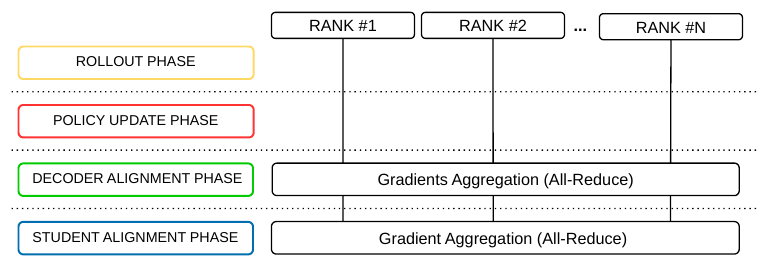

# Anonymous Project Page

This page accompanies an anonymous research submission.

## SIMTT Implementation Details

The implementation also includes parallel optimizations. Training proceeds
through three distinct phases:

- **Rollout Phase:** Each rank performs rollouts using its own teacher, without
  communicating with the other ranks.

- **Policy Update and Decoder Alignment Phase:** Each rank computes the policy
  update gradient for its own teacher independently and in parallel, again
  without any communication with the others (Policy Update Phase). An
  `all_reduce` operation is then performed across all ranks so that each rank
  obtains the average PPO update gradient applied to decoder $$D$$ (Decoder
  Alignment Phase). A single optimizer step is then performed: $$D$$ is updated
  using the averaged gradients, while each teacher encoder $$E_{T_i}$$ is updated
  using its own local gradients.

- **Student Alignment Phase:** After each rank computes the student alignment
  gradient relative to its own teacher, an `all_reduce` operation is performed
  across all ranks to average the gradients. The averaged gradient is then
  backpropagated by all ranks through student encoder $$E_S$$, resulting in a
  synchronized update across all ranks.

*Parallel SIMTT implementation. Each rank updates its local teacher; decoder
and student gradients are aggregated across ranks using All-Reduce.*

## Action Variance

Following the reasoning of Messikommer et al.[^messikommer], we associate the
action outputs of each teacher and of the student with multivariate Gaussians of
dimension $$d$$, with state-dependent means
$$\boldsymbol{\mu}_{T_i}(s_t)$$, $$\boldsymbol{\mu}_S(s_t)$$ and state-independent
diagonal covariances $$\boldsymbol{\Sigma}_{T_i}$$,
$$\boldsymbol{\Sigma}_S$$. In this general setting, the KL-divergence between
the $$i$$-th teacher and the student admits the following closed form, where
$$D_{KL}^{(i)}(s_t) \equiv D_{KL}\!\big(\pi_{T_i}(\cdot\,|\,s_t)\,\|\,\pi_S(\cdot\,|\,s_t)\big)$$:

$$
\begin{aligned}
D_{KL}^{(i)}(s_t)
= {} &\tfrac{1}{2}\!\biggl[
\log\frac{|\boldsymbol{\Sigma}_S|}
         {|\boldsymbol{\Sigma}_{T_i}|}
- d
+ \mathrm{Tr}\!\left(
    \boldsymbol{\Sigma}_S^{-1}
    \boldsymbol{\Sigma}_{T_i}
  \right)\\
&+ \bigl(\boldsymbol{\mu}_{T_i}(s_t)
         - \boldsymbol{\mu}_S(s_t)\bigr)^{\!\top}
  \boldsymbol{\Sigma}_S^{-1}\\
&\quad \times
  \bigl(\boldsymbol{\mu}_{T_i}(s_t)
        - \boldsymbol{\mu}_S(s_t)\bigr)
\biggr].
\end{aligned}
$$

Each teacher $$T_i$$ is a separate expert with its own RL trajectories and its
own characteristic exploration scale. Accordingly, each
$$\boldsymbol{\Sigma}_{T_i}$$ is represented by a separate learned parameter,
which is updated alongside the corresponding teacher encoder $$E_{T_i}$$ during
the PPO updates. The student encoder $$E_S$$, on the other hand, is used purely
as a *deterministic* policy and has no variance of its own: the student
covariance $$\boldsymbol{\Sigma}_S$$ is introduced only to define the Gaussian
surrogate used in the KL-divergence. When evaluating the KL for teacher $$T_i$$,
we set $$\boldsymbol{\Sigma}_S \equiv \boldsymbol{\Sigma}_{T_i}$$ on a
per-teacher basis. The log-determinant, dimensionality, and trace terms then
cancel exactly, leaving

$$
\begin{aligned}
D_{KL}^{(i)}(s_t)
= \tfrac{1}{2}
\bigl(\boldsymbol{\mu}_{T_i}(s_t)
      - \boldsymbol{\mu}_S(s_t)\bigr)^{\!\top}
\boldsymbol{\Sigma}_{T_i}^{-1}\\
\quad \times
\bigl(\boldsymbol{\mu}_{T_i}(s_t)
      - \boldsymbol{\mu}_S(s_t)\bigr).
\end{aligned}
$$

This is the expression actually used in the rollout penalty and in the
auxiliary PPO loss, computed teacher-by-teacher. The intuition is that the loss
grows whenever a teacher is confident in its actions, corresponding to a small
$$\boldsymbol{\Sigma}_{T_i}$$, while its mean still differs significantly from
that of the student encoder $$E_S$$. During the PPO update, the gradient aligns
the teacher mean with the student mean through $$E_{T_i}$$ and increases the
teacher's variance in action dimensions where substantial disagreement remains.
The resulting broader action distribution encourages exploration during the
teacher's rollouts and increases the likelihood of discovering behaviors that
$$E_S$$ can learn. Crucially, since each teacher owns a separate variance
parameter, this exploration pressure is adapted independently to each task,
rather than being averaged across all of them as it would be with a single
shared $$\boldsymbol{\Sigma}_T$$.

[^messikommer]: N. Messikommer, J. Xing, E. Aljalbout, and D. Scaramuzza,
    “Student-Informed Teacher Training,” *International Conference on Learning
    Representations (ICLR)*, 2025.
